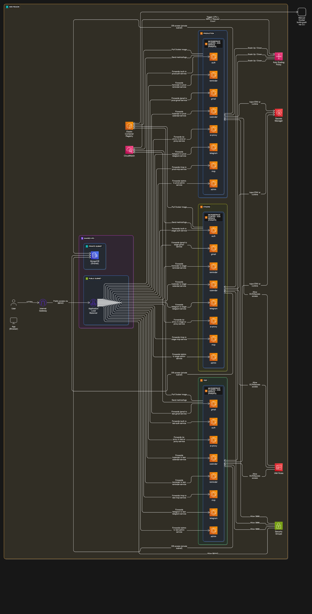

# 🚀 Semi-Automated ECS Microservices Infrastructure

A production-ready template for deploying containerized microservices on AWS ECS using Fargate, demonstrating infrastructure setup and deployment automation without complex CI/CD tools. This project serves as a learning resource and reference implementation for DevOps engineers.

[](LICENSE)
[](https://aws.amazon.com/ecs/)
[](https://www.docker.com/)

## 📖 Table of Contents

- [Overview](#-overview)
- [Features](#-features)
- [Project Structure](#-project-structure)
- [Prerequisites](#-prerequisites)
- [Architecture](#-architecture)
- [Implementation Guide](#-implementation-guide)
- [Security](#-security)
- [Documentation](#-documentation)
- [Contributing](#-contributing)
- [License](#-license)

## 🎯 Overview

This repository provides a template and guide for implementing a scalable microservices infrastructure on AWS ECS. It focuses on:

- **Semi-Automated Deployments**: Manual control with automation scripts
- **Infrastructure as Code**: Templated configurations and deployment scripts
- **Best Practices**: Security, scaling, and monitoring implementations
- **Learning Resource**: Detailed documentation and implementation guides

## 🌟 Features

### Infrastructure
- ECS Fargate for container orchestration
- Application Load Balancer (ALB) for traffic routing
- Auto-scaling based on CloudWatch metrics
- VPC with public/private subnet architecture

### Deployment
- Automated deployment scripts
- Environment-specific configurations
- Rolling updates and rollbacks
- Container image management

### Security
- AWS Secrets Manager integration
- IAM role-based access control
- Network security with security groups
- SSL/TLS termination at ALB

### Monitoring
- CloudWatch metrics and alarms
- Health checks and logging
- Auto-scaling notifications
- Performance monitoring

## 📁 Project Structure

```plaintext
/
├── 📂 deploy-scripts/           # Deployment automation scripts
│   ├── push-to-ecr.sh          # ECR image management
│   ├── update-task-definition.sh # Task definition updates
│   └── update-service.sh       # Service deployment
│
├── 📂 task-definitions/         # ECS task definition templates
│   ├── task-def-prod.json      # Production configuration
│   ├── task-def-stage.json     # Staging configuration
│   └── task-def-test.json      # Testing configuration
│
├── 📂 cloudwatch-alarms/        # Monitoring configurations
│   └── fargate-scaling-policy.json # Auto-scaling settings
│
├── 📂 diagrams/                 # Architecture visualizations
│   └── ecs-architecture.svg    # System architecture diagram
│
├── 📄 architecture.md           # Architecture documentation
├── 📄 deployment.md             # Deployment procedures
├── 📄 autoscalling.md           # Scaling configuration guide
├── 📄 security.md               # Security implementation
├── 📄 env-setup.md              # Environment setup guide
├── 📄 implementation-guide.md    # Implementation tutorial
└── 📄 ecs-deployment-sop.md     # Standard operating procedures
```

## ⚙️ Prerequisites

### Required Tools
- AWS CLI v2
- Docker Desktop
- Bash shell (Git Bash for Windows)
- Text editor (VS Code recommended)

### AWS Requirements
- AWS Account with administrative access
- Configured AWS credentials
- ECR repositories
- VPC and subnet configuration

## 🏗️ Architecture

Refer to our comprehensive architecture documentation:
- [System Architecture](architecture.md)
- [Deployment Workflow](deployment.md)
- [Security Model](security.md)



## 🛠️ Implementation Guide

1. **Initial Setup**
   ```bash
   # Clone the repository
   git clone https://github.com/yourusername/semi-automated-microservices-on-ecs.git
   cd semi-automated-microservices-on-ecs
   
   # Review implementation guide
   cat implementation-guide.md
   ```

2. **Environment Configuration**
   - Follow [env-setup.md](env-setup.md)
   - Configure AWS credentials
   - Set up secrets in AWS Secrets Manager

3. **Deployment**
   - Review [ecs-deployment-sop.md](ecs-deployment-sop.md)
   - Follow deployment procedures in [deployment.md](deployment.md)
   - Monitor deployment status

## 🔒 Security

Security implementation details:
- IAM roles and policies
- Network security
- Secret management
- SSL/TLS configuration

Refer to [security.md](security.md) for complete documentation.

## 📚 Documentation

### Core Documentation
- [Architecture Guide](architecture.md)
- [Deployment Guide](deployment.md)
- [Security Guide](security.md)
- [Environment Setup](env-setup.md)

### Additional Resources
- [Implementation Tutorial](implementation-guide.md)
- [Auto-scaling Configuration](autoscalling.md)
- [Standard Operating Procedures](ecs-deployment-sop.md)

## 🤝 Contributing

We welcome contributions! Please follow these steps:

1. Fork the repository
2. Create a feature branch
3. Commit your changes
4. Push to your branch
5. Create a Pull Request


## 📄 License

This project is licensed under the MIT License - see the [LICENSE](LICENSE) file for details.

---

⭐ Found this project helpful? Please star it on GitHub!

[Report Issues](https://github.com/braintech53/semi-automated-microservices-on-ecs/issues) | [Request Features](hhttps://github.com/braintech53/semi-automated-microservices-on-ecs/issues)